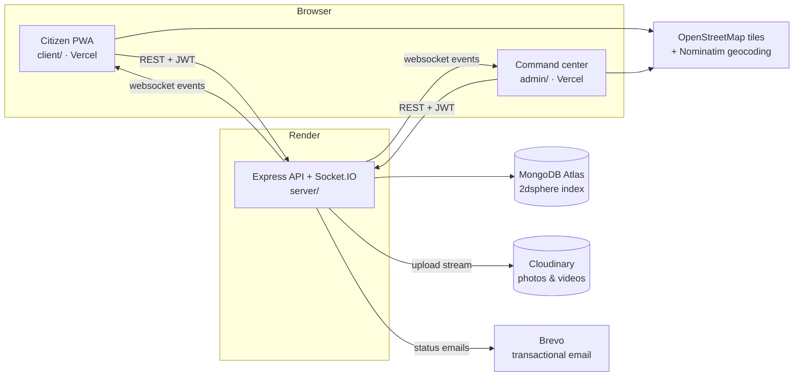

# Architecture & system design

## Components



- **One API serves both frontends.** Roles live in the JWT (`citizen`, `staff`, `admin`) and are re-checked against the database on every request, so a deactivated account loses access immediately.
- **Media never touches MongoDB.** Uploads are streamed to Cloudinary, and only the secure URL and `publicId` are stored on the issue. Without `CLOUDINARY_URL`, files go to local disk, which is fine for development.
- **Realtime** uses Socket.IO rooms: `user:<id>` for personal notifications, `staff` for the command center feed, plus public `issue:changed` broadcasts.

## Server layout

```
server/src
  config/env.ts            all configuration, validated at boot in production
  constants.ts             statuses, categories, points, SLA hours
  models/                  User, Issue, Department, Notification, RewardTransaction
  middleware/              auth (JWT, optional auth, role guard), error handling
  services/
    routing.service.ts     category inference, department routing, $near duplicate search
    rewards.service.ts     points ledger, leaderboard, achievements
    notification.service.ts in-app + socket + email fan-out
    analytics.service.ts   one $facet aggregation powering the dashboards
    chat.service.ts        rule-based assistant
    realtime.ts            Socket.IO
    bootstrap.service.ts   default departments + first admin
  controllers/ routes/     HTTP layer (Zod-validated)
  scripts/seed.ts          demo data
tests/api.test.ts          end-to-end API tests on a real mongod
```

## Data model

**Issue** (the core document)

| Field | Purpose |
|---|---|
| `title`, `description`, `category`, `urgency` | What and how bad |
| `status` | `pending → verified → in-progress → resolved → closed`, or `rejected` |
| `coordinates {lat,lng}` and `geo` (GeoJSON Point, 2dsphere) | `geo` is derived in a pre-validate hook and powers `$near`/`$geoWithin` |
| `location`, `ward` | Reverse-geocoded address and ward, used for ward analytics |
| `attachments[]` | Cloudinary URLs, MIME type, size, `publicId` |
| `assignedDepartment`, `assignedTo` | Routing and the field worker |
| `upvotes[]`, `upvoteCount` | "I see this too" |
| `communityVotes[] {user, verdict, severity}`, `communityVerified` | Crowd verification |
| `possibleDuplicateOf`, `duplicateCount` | Deduplication links |
| `verifiedAt`, `resolvedAt` | SLA and resolution-time metrics |
| `feedback {satisfied, rating, comment}` | Reporter's confirmation |
| `timeline[] {status, note, byName, at}` | Audit trail shown to citizens |

Indexes: `geo` 2dsphere, a text index on title/description/location, and indexes on `status`, `category`, `urgency`, `ward`, `assignedDepartment`, `reporterUser` and `createdAt`.

**User**: phone (+91, unique), email (unique), bcrypt password (`select:false`), `role`, `department` (staff), `points`, `emailNotifications`, `isActive`.
**Department**: `name`, `code`, `color`, `categories[]` (the routing table), contact details.
**Notification**: per-user inbox entry, optionally linked to an issue.
**RewardTransaction**: append-only points ledger. `User.points` is the running total.

## Key workflows

### Reporting
1. On open, the form requests GPS (HTML5 Geolocation) and reverse-geocodes the pin to an address and ward.
2. When location and category are known, the client calls `GET /issues/nearby`. Open same-category issues within 50 m are shown with an **Upvote instead** button. The citizen must tick "mine is different" to continue.
3. `POST /issues` (multipart): files stream to Cloudinary, the category is inferred from keywords if missing, and the department comes from `Department.categories`. The server repeats the `$near` check and sets `possibleDuplicateOf` if needed, so officials see the link even when a client skipped the check. It writes the timeline, awards +5 points, and emits `issue:created` to staff.

### Crowd verification
- `GET /issues/verify-queue` returns pending or verified issues within 2 km that the user didn't report and hasn't voted on.
- `POST /issues/:id/verify` is guarded atomically (`communityVotes.user $ne me`), so each user votes once. It awards +2. When confirmations reach the threshold (3), the issue becomes `communityVerified`, and urgency is raised to the confirmers' median severity if that is higher. The reporter is notified.

### Official workflow
- `PATCH /issues/:id` (staff/admin). Staff are limited to their department and cannot reassign departments. Status changes stamp `verifiedAt`/`resolvedAt`, append to the timeline, and adjust points: +10 on first verification, +5 on resolution, −5 on rejection. A rejection requires a reason.
- Every status change notifies the reporter in-app and over the socket, and by Brevo email if they opted in. Assigning a field worker notifies that worker.
- After `resolved`, the reporter confirms (→ `closed`) or reopens (→ `in-progress`, with their comment on the timeline).

### Analytics
`GET /admin/analytics` runs a single `$facet` aggregation that returns totals, status/category/urgency breakdowns, per-ward and per-department performance (resolution rate, average hours, SLA breaches), a daily trend, hotspots (open issues grouped on a 0.001° grid, about 110 m) and resolution time per category. Staff get the same payload scoped to their department.

SLA targets: critical 24 h, high 72 h, medium 7 days, low 14 days.

## Security
- Passwords are hashed with bcrypt (cost 12) and never serialized.
- JWTs are signed with `JWT_SECRET`; the server refuses to boot in production without it.
- Zod validates every request body. Multer accepts only image and video MIME types, 15 MB each, at most 5 files.
- Helmet, an explicit CORS allow-list (`CORS_ORIGINS`), and rate limits on login, signup, report creation and chat. `trust proxy` is set for Render.
- The public issue view strips reporter phone and email, voter lists and staff identities from the timeline.

## Design decisions
- **Cloudinary instead of Firebase Storage.** The project brief mentions Firebase, but the existing code already used Cloudinary, which has a usable free tier and on-the-fly image transforms. New Firebase Storage buckets now require the paid Blaze plan. The storage layer (`utils/storage.ts`) is the only place to change if you switch.
- **Phone/email + password with JWT instead of Firebase Auth.** This keeps a single identity store in MongoDB, with RBAC in the same token. OTP login can be added later in `auth.controller.ts`.
- **Rule-based assistant.** It is deterministic, free, and works offline from any LLM vendor. `chat.service.ts` exposes one function (`chatReply`), so an LLM can be swapped in behind it.
- **OpenStreetMap + Leaflet.** No API key or billing. Nominatim is called from the browser, under its fair-use policy.
